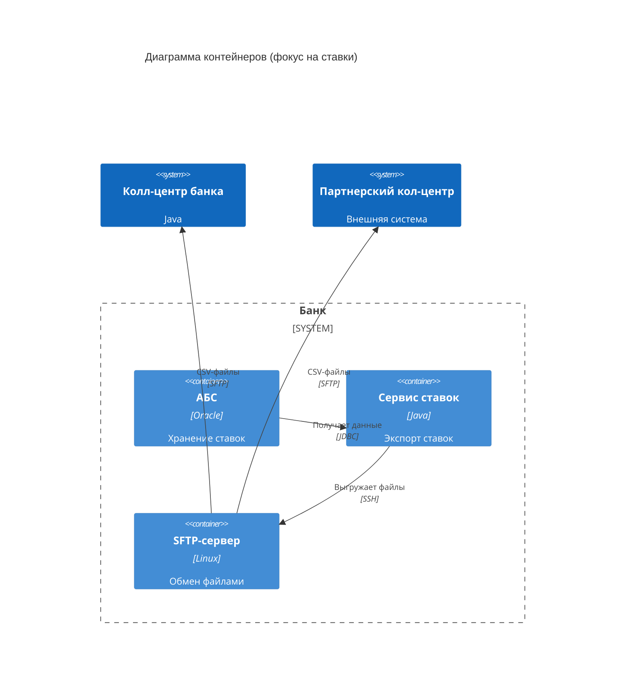
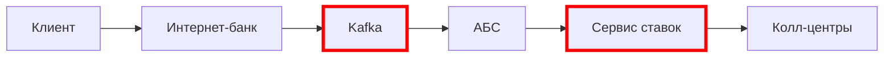
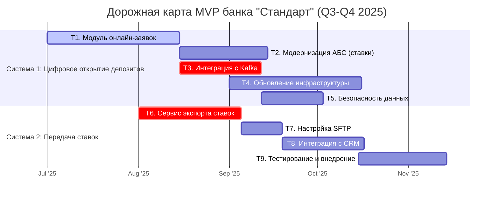
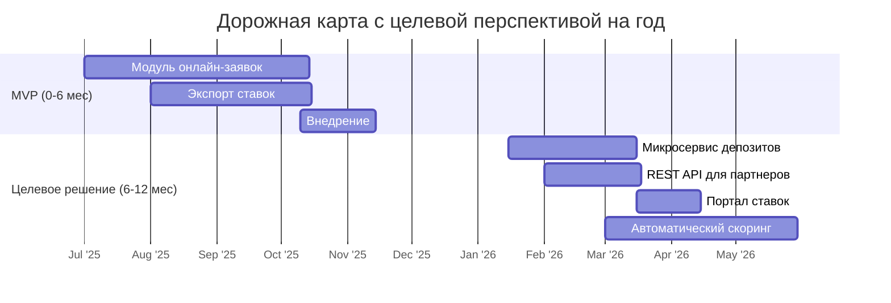
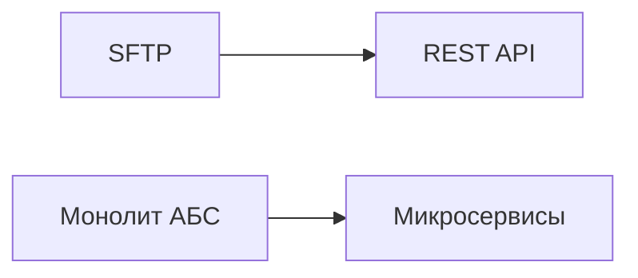

## Цифровая трансформация банка «Стандарт» 

«Стандарт» — это небольшой банк. У него есть сайт и интернет-банк, но клиенты редко ими пользуются. Сайт умеет только показывать маркетинговую информацию, а функционал интернет-банка ограничивается проведением платежей и открытием текущих счетов (дебетовых карт). Чтобы привлечь клиентов, нужно расширить функционал онлайн-каналов. 

**

 Карта бизнес-возможностепй (Business Capabilty Map):**

**

Структура компании**

## **Задание1**
Исходя из имеющийся Business Capabilty Map, а также описание организационной структуры предприятия необходимо создать в draw.io:
1) Карту текущего IT-ландшафта. В строках она должна содержать элементы организационной структуры, а в колонках — бизнес-возможности второго уровня. 
2) Схему интеграции приложений с указанием участников процессов.

##### Решение

1) [Карта IT-ландшафта](https://drive.google.com/file/d/1zULzYYv1pwe0D8YKBGD46XRNuDLeZhAH/view?usp=sharing)(`Карта IT-ландшафта.drawio.png`) размещена в директории Task1.

2. [Диаграмма интеграции](https://www.plantuml.com/plantuml/png/hLLDJ_D64BxlhnYHGo-r5441qKD5Fc8-hcrFRGycMOA5OoDd8wWgf8IFKYbgARSAzQEvz5RLf8b870X_OVOVTNQT1dl9Yz2hryB8UkQPPsOUppgRJU64ejNmcCVt1OW0GhT-8A3cXhmgtC1dpKFNFt92fm4rlk-qFF45Fn45pwtx3UuBgD8_7ZBs4U1l6CcEF9DjdE8OOno1_1xxE9Hd1FHJGeKm38vBWHU4aCldLrTj6_H56lzGTenJItPmX8zq3s6cESI9qZHbxC0NXXJ9_9NK1Iezn5WfO0Ia5sNL8dcfE-zHV4G8TVmZJYZuGFVZoxwhWkfynm2AJlMm7WOjlpQllMxRDaMU-zdpYAIuGLZZuPotihAnmKvPIlRB9YyvJKx29fa6CaIF3rp1PyZdubkFWn-43SVBAfOTuUnfoOLKFVFVwK5b5t105aJuBvaJ4VmWkypHyoxXhR8c8Iw1quJ2V5wcjiJnwrvIgjNaLIfBAJqI6S_enJazpVX56poaSe_gLLbuXn4znadAyiASMvnIAnEBzYffkosxcbzQIE_XL7FESQ1tAGPveRUJKYsANU28zYpI2kMK0ltDvoAP6rgAUCvVqfE-NWRlCYaOVUrJR8XFLFkUa3Fge8jZK8awCD4zL21dssiRnK_Ugq2irthmRlcjbFnfCkQ-goQid5IvPv4KlJESq2x83YHd1liOwtKOQGKRSiLy9LzPUpsrhNjA9sxF4xFU0btuCzvWJprfwWxaodJPwwg_Qj0u2dpk2-t2hzYpv0zKvYUyrzpT_xd9JXEbBw-LmxgDQ_DRGjqOvrz1h03MLxEpzetr6HHV0CicKZA1Cjio0FWKy7Uoy4cVfpurVQtMFEth2DH206yuhiVAsVmAgsG1swomRG8xhFW2M3QHaWcKJQ1Y0ZjPO9VjPe62jluFUQvEh_gGohRUlo7W935UJJfG3e1QOdcbml8Ij3TJTPR9b8x-rjhFqX_N0Y5uJPkXpFmpoIJQ6CY-FZqCsFP2_fR9L--0QbofDy0-SBjlRVEjxMrolqQ_n_y1)(`Диаграмма интеграции.puml`) размещена в директории Task1.

###### **Схема интеграции приложений и участников процессов** 

**Участники процесса:**

- Клиент (через сайт, интернет-банк, отделение, кол-центр)

- Фронт-офис (сотрудники отделений)

- Бэк-офис (депозитный и кредитный отделы)

- Кол-центр (банковский и партнёрский)

- IT-системы (АБС, интернет-банк, сайт, СМС-шлюз)

**Схема взаимодействия:**

1. **Через отделение:**

- Клиент приходит в отделение → сотрудник фронт-офиса вручную создаёт заявку в АБС.

- Если требуется расчёт ставки → запрос в бэк-офис (через email + Excel).

- Бэк-офис проверяет данные в АБС (кредитные риски) → возвращает ставку.

- Фронт-офис оформляет депозит в АБС → клиенту отправляется СМС (через СМС-шлюз).

2. **Через кол-центр:**

- Клиент звонит → оператор создаёт обращение в системе кол-центра.

- Заявка передаётся в АБС → бэк-офис вручную рассчитывает ставку.

- Клиенту отправляется СМС с предложением прийти в отделение.

3. **Через интернет-банк (планируемый MVP):**

- Клиент подаёт заявку → данные уходят в АБС.

- Бэк-офис обрабатывает заявку → ставка рассчитывается вручную.

- Клиент получает уведомление (СМС/email) → подтверждает открытие депозита.

4. **Через сайт (планируемая функция):**

- Клиент оставляет заявку → данные передаются в кол-центр.

- Оператор связывается с клиентом → далее процесс как в кол-центре.

**Проблемы текущей интеграции:**

- Отсутствие автоматизации расчёта ставок (Excel + ручная обработка).

- Нет прямой интеграции между интернет-банком и кредитным отделом для мгновенного расчёта ставок.

- Дублирование процессов (кол-центр ↔ АБС ↔ бэк-офис).

- Задержки из-за ручных согласований (20-60 минут на открытие депозита).

**Выводы:**

Для перехода к полностью цифровому процессу необходимо:

1) Интегрировать АБС с системой расчёта ставок (исключить Excel).

2) Настроить автоматический обмен данными между кредитным и депозитным отделами (с соблюдением security-политик).

3)  Доработать интернет-банк для онлайн-оформления депозитов (без участия бэк-офиса).

4)  Улучшить интеграцию сайта с кол-центром и АБС для мгновенной обработки заявок.

## **Задание2**
Обобщить весь набор требований в формате FURPS+ таблицы:
1) Выделите архитектурно-значимые требования. В ходе работы учитывайте не только контекст из задания, но и информацию о системах компании из блока «IT-ландшафт компании».
2) По возможности добавьте дополнительные требования, которые кажутся вам важными и могут повлиять на решение. Напишите обоснование для таких требований в поле «Комментарий».

FURPS+ таблица в директории Task2 (`FURPS.md`)

| Код | Требования                         | Комментарий |
|-----|------------------------------------|-------------|
| **F**   | **Функциональные (Functionality)**     |             |
| F1  | Подача заявки через сайт            | Клиент оставляет Ф.И.О. и номер телефона → заявка передаётся в кол-центр. Требуется шифрование PII-данных. |
| F2  | Подача заявки через интернет-банк   | Клиент выбирает счёт, сумму → подтверждает СМС → заявка создаётся в АБС. Требуется интеграция с СМС-шлюзом. |
| F3  | Управление ставками в АБС          | Перенос расчёта ставок из Excel в АБС с доступом для бэк-офиса депозитов/кредитов. |
| F4  | СМС-уведомления                    | Отправка уведомлений при подтверждении ставки и открытии депозита через существующий СМС-шлюз. |
| **U**   | **Удобство использования (Usability)** |             |
| U1  | Соответствие UI гайдлайнам бренда  | Интерфейсы сайта и интернет-банка должны использовать утверждённую дизайн-систему. |
| U2  | Время отклика < 500 мс             | Оптимизация загрузки справочников и кэширование для снижения задержек. |
| **R**   | **Надёжность (Reliability)**           |             |
| R1  | Доступность 99.9%                  | Обеспечение uptime для интернет-банка и АБС за счёт горизонтального масштабирования и failover между ЦОД. |
| R2  | Отказоустойчивость                 | Автоматическое переключение на резервный ЦОД при сбоях. |
| **P**   | **Производительность (Performance)**   |             |
| P1  | Асинхронная обработка заявок       | Использование очередей (Kafka/RabbitMQ) для разгрузки АБС. |
| P2  | Масштабируемость                   | Горизонтальное масштабирование интернет-банка, вертикальное для АБС. |
| **S**   | **Поддерживаемость (Supportability)**  |             |
| S1  | Документация                       | Полная техническая документация для будущего расширения системы. |
| S2  | Совместимость с текущими технологиями | Использование MS SQL, Oracle, .NET, Java для минимизации обучения. |
| **+R**  | **Ограничения (Restrictions)**         |             |
| +R1 | Запрет на доработку ядра подрядчиком | Реализация СМС-функционала силами команды банка. |
| +R2 | Обработка заявок бэк-офисом в MVP   | Автоматизация — на следующем этапе. |

## **Задание3**
1) Подготовьить схему концептуальной архитектуры открытия депозитов для MVP в формате ADR.
2) Приветсти диаграмму контекста MVP решения C4
3) Привести диаграмму контейнетов MVP решения C4

Директория Task3 содержит:
 - Архитектурное решение (ADR) концептуальной архитектуры MVP открытия депозитов (`ADR.md`)  

- [Диаграмма контекста C4](https://www.plantuml.com/plantuml/png/ZLHDRn9H5DtpAvwiQ09buyfLQzLe59qKTDkCC6qd3ZDaUCGqneGMQpN6QbqrnhIoCIuf5g5yqBzmtp_ot3nUEXsOHWWpp7tttNFElUVDIbtQeMnKlPHqfUS8-avJcgWzwj5GxU8-eOxw8kYS1jIXFwg9wnZVZYYyi0HDaJ5KJVK9zu7Ewz4bIlJnk8TxDvNod4qfP212TsjRYeeREcNf1dugTSlrorwZuZH2JsnBMQlVoUT3-_NobYkt6oyRTISi1xvqVBbS3ghvTRTiXvNWgUlK72-_TZjdUROldnUUvAjsNJeXGXjhGRKM-BoZnf9IbXFM0py3KIFmxx6mh4X77mMTGT64XjH9yz8fE9yZqkEbFckdBXO7WXiHaoVK0VAQ2FM5siMc2xMNHs5k7ySdN2Ld0D9BAO4FNyGQTDckxuGRTuE6Nx73dSmzfnRKNLdSWPOgc71xPp6XW-abyOPtpnuprDQGI3P_usfEU0PqnbEZlqOL4tn7KmJ7qFSUIWuno9WshEnd1LqY2_duZHSq1PAYV8wlAwSZpOM972SqHVUSGG0-lYe-fI5Q2dmU1tPsUIyaCCU9ISQYA1QACHPiu16-l_I0LLFtPy1kvdqyng7EoK7zBCaqRDQiC-rivCOfcK5J9yjh79zeWmolNCM794RhAzhH1WJ-T7agJ8GF3RSRa3Wft15ptCmO4GRWa8D0ZeZu7xfPmOlOSi0z5xmNkMQfDGlF7zaOyoFr6QLFu1d00rK7SZJL4IP2FxcS8N-fzV38DAV13OEynZY6tAOV-FscaJgaFc1q8AS-w8YnE0EoC0qsXuJoX-eZgEv7tFAMhsBTyM8l1tEIajy5giMu3qib2xKIgjnq54xCAvCdlc02YwfViLfixrFz7afaktw_M1AhrgD8oMIAsghntevGRxuq-vbzYLhxF7LsC9HXgbFumP0QYCnZU_ELlHJ5dnSIGMv7Ivf3ebgcNHs3mmoAprQjc3XJAExT-KwnPsEEdUdw1eGMys9-n2Gkab3cV7hC-VngZT1cxp7R1oKhKYE-D-gZf16OIWMBAwquVgLHzVu1) (`deposit_mvp_context_diagram.puml`):  
  - Клиент ↔ Сайт/Интернет-банк ↔ Кол-центр ↔ АБС ↔ Бэк-офис.  
- [Диаграмма контейнеров](https://www.plantuml.com/plantuml/png/XLLDRnjL5DtxLpooQaLjRyg6LHsdg42IJZE6RJIrNvE1yOmrVWPL22bDI06r8aMgH8LGYXTyx9YaiJgDiVCNxlj7d3jlycGFCqcisEFtSSwvzvvxVMUel5YD-a5D-IgGWbvIIWczqNju_nUlHD0vpMcczsb2xsX64spDwLHiVEu8ccFvNE_fP_XCzP6WCvowmFvRVDtdSxLQ81yfeI8H-pkxIlJyM7QL7uMrsdj-s0r6FJcA0x6hr63uORCPUrytTdorEteu6igu6uLAXghHZVhDBR_hnRreqvS36JJRj-jEu8NgiutrPjyRAXbZQRiTzGTHo3S6759Dv7_coP7nC0flqAyqHP0JZkcMM5dyAkW4OSyGSRB2MwyHmHbM9jX2I8a-ebDifW9daaAmApSDY_iOQlhRgz4ex7dnunlqYf6pjCqOY7xEASQuzOHtECjWAnwiNufPkIc-iQ6qaHBF3sLS2Nmb53PRhjFOlDj10TlYTkC3yRxOS8NxO3sB-1YdffHmfUkexdVutuE-AUU7irHIOGHU8kvOVv_nJt0X1VBoWj1FQ8xNYVunHtx7z9zwZxxqCXqlS21548UPssQSRxPNQk8o_jHFsNCCPHEPQ_csl1GszL2DM-SSq68PzBEC6fi8ZAl2hkP0ZULnsGef8YK58PHKLUq5xewtwHywOrGcp1-5sUBmrsGmsFLHcVknrmraNfcJh2bFJDF1Vte_MvYnCz65JpcBjuG-o1AzpvMQqnjMo4MqbQeID0PgOkpDTB-nzVK1JVLp19RlpOs3dFNcfLz-fmIxXh1WZHccmk7otHB-jOUN2l3saY7niP2AXGpyOSArLeGxuGTUojnqodmGmGk6_1etZ3C_ddBHJEMN5ghgD-RkC9CZVynISiz1kRQarrMDBuPcUEHcdziKB7GHXDlcoepCGsLUJ662W7ZZ0kTIjfMTGbNfn7J3rXIlFvcCBS9QhCdjHESpTH3dXyp0-yJxoXFk8FR37R4QHGeXET5GxSGIzQvm8V9-c7db2BsSGl3r4iTmrvZ-XhT-ehT0DGjr_ODPOQBDPilmWGNHvyvCXBlXidmxiIafDlsM30eZtfQiSgBh0oQxr-auBi3AKQuQjyUNFuCy94fweHJTgYelsMipBIlLRjrrEwBbVBm0MIsnC8uBYPq2jqXXnt6Heu1Kd6VNARSjBLeF5c6BC1LZwHTAZ6oO9RNPjXt637P0NGzlPyvVk9_tPXDomP4rpFFbSS8TihRQlWht_zv-nR2cm-6G0zRBBcOmzwEEim1MveEIz8wNVXXJoBN02t9faZ7SRpbv0MjtPDWRzOF_0000) (`deposit_mvp_container_diagram.puml`):  
  - Детализация интернет-банка (ASP.NET MVC + MS SQL) и АБС (Delphi + Oracle).  
  - Остальные системы (кол-центр, СМС-шлюз) — как чёрные ящики.  

## **Задание4**

Реализовать архитектурное решение для передачи депозитных ставок в кол-центры. Подготовить RoadMap.

1) Разработать ADR для изменений. Подготовить шаблон ADR для нового кейса. Описать Use Cases, функциональные и нефункциональные требования 
Cоздать диаграммы контекста и компонентов в модели C4. Описать альтернативы и недостатки нового решения.
2) Сформировать список крупных задач для каждой системы из ADR для будущего планирования.
3) Подготовить RoadMap в draw.io, схему последовательности выполнения задач для MVP на горизонте 6 месяцев с учётом изменений в новом кейсе и целевого решения на горизонте года.

### **ADR для изменений** 

Директория Task4 содержит:
- Архитектурное решение (ADR) для передачи депозитных ставок в кол-центры (`ADR_rates.md`)

- [Диаграмма контекста](https://www.plantuml.com/plantuml/png/bLLDR-9M5DtpArwpIgHXKALsCwjHgLgfwbGez6CvOi2TM38sCaPLTr18CnAjqbQH8cLHIglk7GB1cDZv2_VzevvtZSFZuLIP8Ddny_quzznphrzsWuOVzDfEAR03nn9qGH65T2FxkDxX5mgAAQL4_aGBYkK0z_25e0ajOBAWEONoJ1dDyN0FmoL5C4daM9wAp9fcE8u5pR98wxBy6RO8AFjoN2evrlU123pXsszF0j6oVQiPs9vRAdrWkqsdrx9wlYDEWg3JVL6f-8qVdh-rWvFUcrxNyfkU6rXkyBpfjIl7ThFXjxolRAjZEPNgH-MQqt23RrvzMMatke7bu-XrrMjtF5TvT5J59O6_x5gp_Axd7j8LhIdAq3qJ1_gZe6kKag24y42zkkIo4bLjOMcAaRKy5t883b9mbD22pVbeWC0f8aIqCgX3-ACTI7_YdU8wv3Xzv3QFDibtqczGNd7h1d88BB_0EWBdG_W2SxojJK4H2iAsOx5glu7aDo2zWq-2oDi7YfIJXWQlVgSff_-7xbb8CqM5Iciae8Yvova533dW-mg6MM1Qm6m190ob_YDwsJxCKcGmPep_ZjD7p65V1UAG2KxFz-BpeHv_GzQ_Z7NJqaXmIGFypjI977DCr52WTLheXKL0guETShDcAXzDjnE1bFeh8NzLywK2oxwosXaV1ZZXaKlfce4kyqxE6JN3K7HMwzy-4_8TOeuUkbtxlBOBglxPrxNN816UZ4Gzbv6TuQYhhdUJ73d2lolqT9oh73w9KZe3J5ZhDvGM2xC8o8H2BZfHgJTme4Zz58uv1wmwrJQS5wDXbtVlWwDw_4hd0uz5kdmy6CybiERTkStHQReGbEvEBW-P2SDaWy4OP3m9pXyv2_9yJ_3vG1rRZh7rYXRE9OKyoIbaQcm9USgv_eRx6cuZW64jgiMsp7Oaw_TecsulWS4zzpZDPBXP6tWNex8XxbXaHIC7l--iDsMAL1NiEGAabHpecRKDzh120EUQCHOkAGvC5pWUA0JSGAvkPu7gREQ1_s_ijQ_dtWYhX5zy-abL75BCEffpiHz-B3BeHtf1Z-OmvvjRUCFxuDQO6vMmNgrLi2EU7jhKA8lVsFP62hXn3eqh0wMfWobtyvJLaEJBlM3h7UXV0Yo6V8UgLQYLL0YySE1eicbFcak1IohC-nVstbd-fLa-iBoacAVifUMsUctdFm00) (`rates_mvp_context_diagram.puml`)

- [Диаграмма контейнеров](https://www.plantuml.com/plantuml/png/VLDDRzD04BtxLomv1OasAYe2Ughgyg6gXIY5S-KwIsF9iIDd3QeGKjEcj58a2eWJ1weWmTaA2NLIalw5sN_4csm33aInbStipFERdJUpgtNbH2gk-fRob2y5VQAK4lgX3x3-mfi86j28XlgGUjId8VKG6b5dHT0vs_1sAT4d3EnYSuNW1QM03tLB7mlTW9bG1-w1e8vXkrpGRu45gJxGBSlovGibL2WYRw-YHDcBfAkyCB2i6rxW-d5Pnf4lAahLwYk5GkIyMjppL2NUZUioSiD0oK0jkc6rKF9S9og7JpnPatx1Nbue-awWdczj5gfENSa8hXqxhDR2WB-eeMg1nx9utTu7ehgp5iP1sOdsy_I14bGxk2Lo4pDtKxm6rZmsyZfU8AFrtJoz1wGDf35oi9v6ZWivb-wxlAClkW46o3PUUq8Viy2i9duf71cPaEV_B7bgize0fBgnG-s_QD1dOzDC26uuBnsnT9TD-cgo0jAa4Moq5ur8zPcW5CtHBMwyFa831vJCFCRsmsT5CF7V0ceoQR4oVUdnWqrnZotwzczvJMpxTCaIYDlB-kIQ_4r6-pnzvj70-tqo6qpr4UOHRzWvfkjV3z7K675QkxGbW4W4rumCMUvpIb3QeHbWOASTA6KmZvbF0TmfF6TG2_2KTGO44YBJE5L9-dz6OLwxDjRNR4CAmI_6ah3Uz9EwSFJ4qXq1sfI689xmpk6RjCGkCcdn4Hfp2bZJt5DAJ0ioNEQ3cMfpA6S6kOCSV9MJ6JEHOSdAc6L0O2Hu2g3L5P_Q74I_0yMg3CguVBy1)
(`rates_mvp_container_diagram.puml`):

- [Диаграмма компонентов](https://www.plantuml.com/plantuml/png/dLLhJnjN4_xkNt5UFe7UEYuLlIHIgu2XkSWKnqlRZzPYR_5AwrrhVJOjhIe18IKLQUabKgkgAaalLJykn2wBmUOlpFb7VUOSBruSaqfTnFfSPfwPUUQoDzlI3cNKz7BIbPuZw0ab5DDpjOdt6VvYGJqQK5zjKvTEg4zTN0tew8QW0rxZj4EnscN13ZRdk3oc1E9zjQSU2hM5PKn7EEu9EZ9eftdr1MG1gZRLNYxdEHz98GCHkkiDAUfkwDIa6_YvtFzSl-P5TISAFT6GijM-KIY4ziVNrbtPYDQYjXFM0bywlhnM2vg5Ybkpmthmdkkq7AzGdCkNFTkNxo-N2asxBPqGHzLYq6m5Fckq4BN0ayjP6xXjLXU2oA_RuSOqVKin8ksz8gRI9OUijl2RK5TWaUYukdIczgPcn6SvCNoASCTsVITSN9kcRw3z321cCONLIcZNmFBizHhlw1SWzHbQlm7yKFFUXvLJcFWIHrd-ifRqSn7CD3qpOknXTMJuPwXrr0CwLOyl8-6oN2fOzqhQZwSKutON-TmMb8pSw6fNnfsuoeLVXrh7UFUGu8GIW4yuHZbnTT29eBEHW-p9ekEr6gxXXWwruY4DOBp7zJL0TNNvKAESP3pvFFTY1i29bZxYP5Kl21hel6RlXFeAZcrnwQfDbdg1ghlsVLlClYd-BwnMwFhhOY48v4koCL--0wtAahKgi6I4eTw7pfeExW2s4ouVeMavvvw21wW4mU4Aay4hgIvQ7rHlEOZHba78UD_hL1bkjZaC0H6sDD-oQms7LPk1tqvFwNUM0Vc9QMQAqqJlO7b2ftnufVNohN9rEQX7dWCeRFBg4O1sBaEn6MweseOeelayHzlzYmN_YqqBKR35KBC7OQrjaD0dYSdJlGZ3x5DjwJScLUVmT5J6ED1vHj9JytJsRsLalRjQhbfEU5yRvrqUwgPwy6PhbTjB9V4MocEbvVYMTVibfM4XO_OwCqT_Z3SxGorz8kTq0D_X5jxXNpTBXYYr9wPNLqjllpRNcBcIiFb8DlJeKG_Kjfcrp3qpPVf7xRCPE9kd7Z2_Hlidsl0J6d3zeodF1NLmjJySsjcnhOc_n5o6l-4yHIZJz9FHf3zJnMgniWmpU0iw71kk0tfEWudMueisN5hIx4vkYb9WrqsD_62-OeZYc2EZNbhxQGVRijRGyVv8Psdh8rxjaVvq8RehOZgWcALDnsNZESzUK6pog7UFWBaF9hEV3WZC6F2AuqsUu6QGt5rSA1eirC6ncHB88lrD7LqOiwyBxcNg0o-5qvhZSs9nTKNatqcPkEFdcqup23U4ePZwy6p7J8QqHZA8Os3PAJ2niTd4tAlNtyYlkL9KhFaCL5Ptr11MiIoYbeSKJWq7owZYCyeN2jc4wxuKhSZpM1Vq7V4Sf2IRsonbuunbSIVbDyLlcvfvYgxQnNtCpN4yAZMs8MRLPe4wkdGV0_-cuzUZflSF) (`rates_mvp_component_diagram.puml`):

### **Списки задач** 

Система1: Задачи из ADR Концептуальная архитектура MVP для цифрового открытия депозитов
- T1. Разработка модуля онлайн-заявок в интернет-банке
- T2. Модернизация АБС для автоматического расчета ставок
- T3. Интеграция с очередями Kafka
- T4. Обновление инфраструктуры
- T5. Безопасность данных

Система2: Задачи Из ADR Передача депозитных ставок в кол-центры
- T6. Разработка сервиса экспорта ставок
- T7. Настройка SFTP-инфраструктуры
- T8. Интеграция с CRM колл-центров
- T9. Тестирование и внедрение

Критические задачи (crit, выделены красным):

- Интеграция с Kafka (Система 1)
- Сервис экспорта ставок (Система 2)

От них зависит автоматизация (основная цель MVP), операционные риски, производительность.

Их место в общей архитектуре:

### **RoadMap** 

[RoadMap MVP (на горизонте 6 месяцев) в draw.io](https://drive.google.com/file/d/1XwHAN_xJRTXyKFCQHL8tD63JDwgr6O6u/view?usp=sharing)(`/Task4/RoadMap_MVP_bank_Standart.drawio.png`) 

RoadMap на горизонте 6 месяцев, со стартом Q3 2025, объединяющая обе системы в единую схему выполнения задач

Хронология:

- Старт: 1 июля 2025 (Q3 2025)
- Завершение MVP: 15 декабря 2025 (6 месяцев)

Этапы:

- Q3 2025 (июль-сентябрь): Разработка ядра
- Q4 2025 (октябрь-декабрь): Интеграция и тестирование

### **RoadMap с учётом целевого решения на горизонте год**
[RoadMap в draw.io целевого решения на горизонте года](https://drive.google.com/file/d/12e9yoXAaq_cHn04mw7HBAYFCYoe6W4yk/view?usp=sharing)(`/Tak4/RoadMap_target_bank_Standart.drawio.png`)

**1. MVP (0-6 мес.)**

   Фокус: Базовый функционал с обходными решениями

- SFTP вместо API для партнеров
- Ручная обработка заявок в АБС

**2. Целевое состояние (6-12 мес.)**
 
- Эволюция архитектуры

- Новые возможности:

  - Автоматический скоринг клиентов
  - Единый каталог продуктов

**3. Критические переходы**

| **Этап**          | **Технологический долг**          | **Решение**                     |
|--------------------|-----------------------------------|---------------------------------|
| После MVP          | Ручная обработка ставок          | Микросервис депозитов          |
| Годовая точка      | Файловый обмен с партнерами      | API-шлюз с audit logging       |

**5. Итоговые метрики**

К Q2 2026:

- 100% онлайн-заявок

- ≤5 мин на обработку депозита

- 0 ручных операций в бэк-офисе

Итоговое решение обеспечивает плавную эволюцию системы без потери работоспособности текущих процессов.