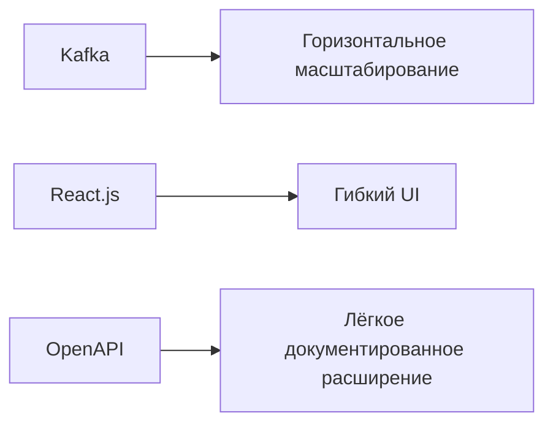

#### **Архитектурное решение (ADR) концептуальной архитектуры MVP открытия депозитов**

### **Название задачи:** 
**Концептуальная архитектура MVP для цифрового открытия депозитов** 
### **Автор:**
**Разработчик IT отлела**
### **Дата:**
**21.04.2005**
### **Функциональные требования**

---
 
Use Cases для MVP:  

| №  | Действующие лица/системы       | Use Case                          | Описание                                                                 |
|----|--------------------------------|-----------------------------------|--------------------------------------------------------------------------|
| 1  | Клиент                         | Подача заявки на депозит через сайт | Клиент оставляет Ф.И.О. и номер телефона → заявка передаётся в кол-центр. |
| 2  | Клиент                         | Подача заявки через интернет-банк | Клиент выбирает счёт и сумму → подтверждает СМС → заявка создаётся в АБС. |
| 3  | Кол-центр                      | Обработка заявки с сайта          | Менеджер кол-центра связывается с клиентом для уточнения условий.        |
| 4  | Бэк-офис                      | Подтверждение заявки в АБС        | Сотрудник бэк-офиса проверяет и подтверждает заявку → отправка СМС клиенту. |
| 5  | АБС                           | Расчёт ставок                     | Автоматический расчёт ставок на основе данных из АБС (вместо Excel).     |

---

### **Нефункциональные требования**  

| №  | Требование                                                                 |
|----|---------------------------------------------------------------------------|
| 1  | Доступность 99.9% для интернет-банка и АБС.                              |
| 2  | Шифрование PII-данных (TLS 1.2+).                                        |
| 3  | Время отклика интерфейсов < 500 мс.                                      |
| 4  | Асинхронная обработка заявок через Kafka/RabbitMQ для разгрузки АБС.     |
| 5  | Горизонтальное масштабирование интернет-банка.                           |

---

### **Решение**  
**Архитектурные решения:**  
1. **Интеграция через очереди сообщений** (Kafka/RabbitMQ) для разгрузки АБС.  
2. **Микросервис для управления ставками** (отдельно от АБС).  
3. **Горизонтальное масштабирование интернет-банка** (Docker + Kubernetes).  
4. **Шифрование данных end-to-end** (TLS + шифрование в БД).  

**Диаграммы C4:**  
- [Диаграмма контекста C4](https://www.plantuml.com/plantuml/png/ZLHDRn9H5DtpAvwiQ09buyfLQzLe59qKTDkCC6qd3ZDaUCGqneGMQpN6QbqrnhIoCIuf5g5yqBzmtp_ot3nUEXsOHWWpp7tttNFElUVDIbtQeMnKlPHqfUS8-avJcgWzwj5GxU8-eOxw8kYS1jIXFwg9wnZVZYYyi0HDaJ5KJVK9zu7Ewz4bIlJnk8TxDvNod4qfP212TsjRYeeREcNf1dugTSlrorwZuZH2JsnBMQlVoUT3-_NobYkt6oyRTISi1xvqVBbS3ghvTRTiXvNWgUlK72-_TZjdUROldnUUvAjsNJeXGXjhGRKM-BoZnf9IbXFM0py3KIFmxx6mh4X77mMTGT64XjH9yz8fE9yZqkEbFckdBXO7WXiHaoVK0VAQ2FM5siMc2xMNHs5k7ySdN2Ld0D9BAO4FNyGQTDckxuGRTuE6Nx73dSmzfnRKNLdSWPOgc71xPp6XW-abyOPtpnuprDQGI3P_usfEU0PqnbEZlqOL4tn7KmJ7qFSUIWuno9WshEnd1LqY2_duZHSq1PAYV8wlAwSZpOM972SqHVUSGG0-lYe-fI5Q2dmU1tPsUIyaCCU9ISQYA1QACHPiu16-l_I0LLFtPy1kvdqyng7EoK7zBCaqRDQiC-rivCOfcK5J9yjh79zeWmolNCM794RhAzhH1WJ-T7agJ8GF3RSRa3Wft15ptCmO4GRWa8D0ZeZu7xfPmOlOSi0z5xmNkMQfDGlF7zaOyoFr6QLFu1d00rK7SZJL4IP2FxcS8N-fzV38DAV13OEynZY6tAOV-FscaJgaFc1q8AS-w8YnE0EoC0qsXuJoX-eZgEv7tFAMhsBTyM8l1tEIajy5giMu3qib2xKIgjnq54xCAvCdlc02YwfViLfixrFz7afaktw_M1AhrgD8oMIAsghntevGRxuq-vbzYLhxF7LsC9HXgbFumP0QYCnZU_ELlHJ5dnSIGMv7Ivf3ebgcNHs3mmoAprQjc3XJAExT-KwnPsEEdUdw1eGMys9-n2Gkab3cV7hC-VngZT1cxp7R1oKhKYE-D-gZf16OIWMBAwquVgLHzVu1) (`deposit_mvp_context_diagram.puml`):  
  - Клиент ↔ Сайт/Интернет-банк ↔ Кол-центр ↔ АБС ↔ Бэк-офис.  
- [Диаграмма контейнеров](https://www.plantuml.com/plantuml/png/XLLDRnjL5DtxLpooQaLjRyg6LHsdg42IJZE6RJIrNvE1yOmrVWPL22bDI06r8aMgH8LGYXTyx9YaiJgDiVCNxlj7d3jlycGFCqcisEFtSSwvzvvxVMUel5YD-a5D-IgGWbvIIWczqNju_nUlHD0vpMcczsb2xsX64spDwLHiVEu8ccFvNE_fP_XCzP6WCvowmFvRVDtdSxLQ81yfeI8H-pkxIlJyM7QL7uMrsdj-s0r6FJcA0x6hr63uORCPUrytTdorEteu6igu6uLAXghHZVhDBR_hnRreqvS36JJRj-jEu8NgiutrPjyRAXbZQRiTzGTHo3S6759Dv7_coP7nC0flqAyqHP0JZkcMM5dyAkW4OSyGSRB2MwyHmHbM9jX2I8a-ebDifW9daaAmApSDY_iOQlhRgz4ex7dnunlqYf6pjCqOY7xEASQuzOHtECjWAnwiNufPkIc-iQ6qaHBF3sLS2Nmb53PRhjFOlDj10TlYTkC3yRxOS8NxO3sB-1YdffHmfUkexdVutuE-AUU7irHIOGHU8kvOVv_nJt0X1VBoWj1FQ8xNYVunHtx7z9zwZxxqCXqlS21548UPssQSRxPNQk8o_jHFsNCCPHEPQ_csl1GszL2DM-SSq68PzBEC6fi8ZAl2hkP0ZULnsGef8YK58PHKLUq5xewtwHywOrGcp1-5sUBmrsGmsFLHcVknrmraNfcJh2bFJDF1Vte_MvYnCz65JpcBjuG-o1AzpvMQqnjMo4MqbQeID0PgOkpDTB-nzVK1JVLp19RlpOs3dFNcfLz-fmIxXh1WZHccmk7otHB-jOUN2l3saY7niP2AXGpyOSArLeGxuGTUojnqodmGmGk6_1etZ3C_ddBHJEMN5ghgD-RkC9CZVynISiz1kRQarrMDBuPcUEHcdziKB7GHXDlcoepCGsLUJ662W7ZZ0kTIjfMTGbNfn7J3rXIlFvcCBS9QhCdjHESpTH3dXyp0-yJxoXFk8FR37R4QHGeXET5GxSGIzQvm8V9-c7db2BsSGl3r4iTmrvZ-XhT-ehT0DGjr_ODPOQBDPilmWGNHvyvCXBlXidmxiIafDlsM30eZtfQiSgBh0oQxr-auBi3AKQuQjyUNFuCy94fweHJTgYelsMipBIlLRjrrEwBbVBm0MIsnC8uBYPq2jqXXnt6Heu1Kd6VNARSjBLeF5c6BC1LZwHTAZ6oO9RNPjXt637P0NGzlPyvVk9_tPXDomP4rpFFbSS8TihRQlWht_zv-nR2cm-6G0zRBBcOmzwEEim1MveEIz8wNVXXJoBN02t9faZ7SRpbv0MjtPDWRzOF_0000) (`deposit_mvp_container_diagram.puml`):  
  - Детализация интернет-банка (ASP.NET MVC + MS SQL) и АБС (Delphi + Oracle).  
  - Остальные системы (кол-центр, СМС-шлюз) — как чёрные ящики.  

**Комментарии к диаграммам:**  
- Интернет-банк и АБС обмениваются данными через API Gateway и очереди.  
- Сайт использует REST API для передачи заявок в CRM кол-центра.  

---
#### **Логика принятия архитектурных решений**
При проектировании архитектуры MVP для цифрового открытия депозитов мы руководствовались следующими ключевыми принципами:

#### 1. Соответствие функциональным требованиям
- **Автоматизация процессов**:
  - Асинхронные очереди (Kafka) для разгрузки АБС
  - Модуль ставок на PL/SQL для минимального изменения АБС
- **Обратная совместимость**:
  - SOAP API для интеграции с legacy-коллцентром
  - SFTP для СМС-шлюза (существующее решение)

#### 2. Учет нефункциональных требований
| Требование | Реализация |
|------------|------------|
| Производительность (<500 мс) | Кэширование, горизонтальное масштабирование |
| Надежность (99.9% uptime) | Failover между ЦОД, асинхронная обработка |
| Безопасность | TLS 1.2+, изоляция модуля ставок |

#### 3. Минимизация рисков
- Использование текущего стека:
  - ASP.NET MVC 4.5 для интернет-банка
  - Oracle AQ для интеграции
- Постепенная модернизация:
  - Ручная обработка в MVP
  - Логическое выделение модуля ставок

#### 4. Поддержка масштабирования

* Kafka вместо RabbitMQ:

  - Горизонтальная масштабируемость.

  - Поддержка потоковой обработки (для будущего анализа данных).

* React.js на сайте:

  - Гибкость для будущих доработок UI.

* Документированные API:

  - Все интеграции описаны в OpenAPI/Swagger.

##### 5. Ограничения и компромиссы
Отказ от перевода АБС на микросервисы:

- Требует полного перепроектирования (риски для stability).

- Решение: выделение модуля ставок как первого шага.

Совместимость с текущим интернет-банком:

- Kafka не поддерживается текущей версией → временное решение: буферизация запросов через MS SQL.

##### 6. Критические технологические выборы

| **Решение**               | **Альтернатива**       | **Причина выбора**                                                                 |
|---------------------------|------------------------|-----------------------------------------------------------------------------------|
| Kafka для очередей        | RabbitMQ               | Поддержка больших нагрузок и future-proof архитектуры                            |
| PL/SQL для модуля ставок  | Вынос в отдельный сервис | Минимизация изменений в АБС. Быстрая реализация MVP                              |
| SOAP API для колл-центра  | REST API               | Колл-центр работает на legacy-системе. Переход на REST запланирован на этапе 2   |
| Горизонтальное масштабирование интернет-банка | Вертикальное масштабирование | Позволяет гибко наращивать мощность под нагрузкой                          |
| Шифрование TLS 1.2+       | TLS 1.0/1.1            | Соответствие современным стандартам безопасности                                 |
| Асинхронная обработка через очереди | Синхронные вызовы | Защита АБС от перегрузок, отказоустойчивость                                |

---

**Таки образом, архитектура MVP балансирует между:**

- Скоростью реализации (использование текущих технологий).

- Надежностью (асинхронность, failover).

- Гибкостью (Kafka, React.js для будущего роста).

Все решения подкреплены функциональными требованиями (например, обработка заявок) и нефункциональными (производительность, безопасность). Риски смягчены поэтапным внедрением.

---

### **Альтернативы**  
1. **Прямая интеграция интернет-банка с АБС через API**  
   - *Недостатки*: Риск перегрузки АБС, нарушение 99.9% uptime.  
2. **Хранение ставок в отдельной SQL-БД** (не в АБС)  
   - *Недостатки*: Дублирование данных, сложность синхронизации.  

---

### **IT-команды для реализации:**  
1. **Команда интернет-банка** (10 человек + подрядчик):  
   - Разработка UI, интеграция с СМС-шлюзом и очередями.  
2. **Команда АБС** (20 человек):  
   - Реализация модуля расчёта ставок, доработка API.  
3. **Команда кол-центра** (5 человек от подрядчика):  
   - Настройка CRM для обработки заявок с сайта.  
4. **DevOps** (2 человека):  
   - Настройка Kubernetes, мониторинг, CI/CD.  

### **Недостатки, ограничения и риски выбранного решения**

### 1. Архитектурные недостатки

* **Монолитная АБС**

  - Сложность внедрения новых функций (например, мгновенный расчет ставок)
  - Каскадные сбои: ошибка в модуле ставок может "положить" весь процессинг

*  **Ручная обработка заявок** бэк-офисом сохранена в MVP

* **Гибридные интеграции:**  Kafka + Legacy АБС, REST (сайт) + SOAP (АБС), необходимость реализации промежуточного слоя (ESB)

### 2. Технические недостатки
##### **Унаследованные технологии**
- Ядро АБС (Delphi)	Устаревшая кодовая база, дефицит разработчиков.	Высокая стоимость поддержки, медленная реализация изменений (+30% к срокам)
- SOAP API	Громоздкий формат сообщений, высокая latency. Задержки до 500 мс при обработке заявок из колл-центра.
- SFTP для СМС	Отсутствие end-to-end шифрования, ручное управление ключами	Риск утечки персональных данных (GDPR non-compliance)

### Технологические ограничения
| **Аспект**               | **Риск/Ограничение**                                                                 | **Меры смягчения** |
|--------------------------|-------------------------------------------------------------------------------------|--------------------|
| Использование Kafka      | Текущая версия интернет-банка несовместима → требуется промежуточный слой           | Разработка адаптера на MS SQL |
| Вертикальное масштабирование АБС | Ограничение производительности при росте нагрузки                               | Мониторинг + планирование апгрейда железа |
| SOAP API колл-центра     | Низкая скорость интеграции (vs REST)                                                | График миграции на REST |

Ограничения масштабируемости:

- Вертикальное масштабирование Oracle RAC имеет ограничение CPU 32 ядра
- Интернет-банк: Горизонтальное масштабирование требует перевода на .NET Core+ (текущая версия 4.5 не поддерживает Kubernetes).

### **Риски выбранного решения** 

Вылены следующие виды рисков:
- Технологические, связанные с внедрение технологических изменений
- Бизнес-риски (сроки, финансовые)
- Риски безопасности системы (SFTP для СМС - устаревший протокол)
- Key Person Risk (кадровые)

###### **Сравнение с industry standards**

Для банковских проектов типичное распределение:

- Технологические: 40-50%

- Безопасность: 15-25%

- Кадровые: 5-15%

Приведенная оценка соответствует решению, с поправкой на:

 - Монолит legacy-АБС (+5-10% к технологическим)
 - Сложность декомпозиции АБС в будущих сценариях (+5-10% к технологическим).
  - Бизнес риски обусловлены интеграциями legacy-систем и зависимостью от внешних партнеров

### **Выводы**
**Выбранная архитектура сознательно жертвует:**

- Масштабируемостью в пользу скорости вывода MVP

- Автоматизацией для минимизации изменений в АБС

- Современными стандартами (REST, gRPC) из-за legacy-ограничений
